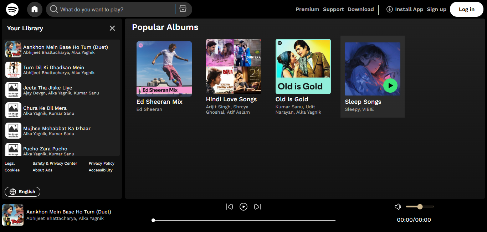

# Spotify Clone - A Frontend Music Player



## Overview

This project is a **frontend-only Spotify clone** built using vanilla HTML, CSS, and JavaScript. It mimics the core UI and functionality of Spotify's web player, allowing users to browse playlists (albums), view songs, and play music directly in the browser. No backend server is required—everything runs client-side using the Fetch API to load local files (songs, thumbnails, and metadata) from directories.

The app dynamically fetches and displays playlists, songs, and thumbnails. It includes responsive design for various screen sizes, audio controls (play/pause, next/previous, seek, volume), and a sidebar for song lists. Music files are stored in local folders, and the app assumes you're running it via a local server (e.g., VS Code Live Server on port 5500) to bypass CORS restrictions. A hosted version is available at [https://vivek-spotify-clone.rf.gd/](https://vivek-spotify-clone.rf.gd/), though it may experience slower response times due to hosting limitations.

This is an educational project to demonstrate dynamic content loading, audio manipulation, and responsive web design without frameworks.

## Features

- **Dynamic Playlist Loading**: Automatically fetches and displays albums/playlists from the `Playlists` directory.
- **Song Playback**: Play, pause, next, previous, seek, and volume controls using the HTML5 Audio API.
- **Responsive Design**: Adapts to different screen sizes (desktop, tablet, mobile) using media queries.
- **Sidebar Library**: Displays songs in a scrollable sidebar with thumbnails and metadata.
- **Footer Player**: Shows current song details, progress bar, and controls.
- **Metadata Handling**: Reads album info from `info.json` files and displays titles, artists, and covers.
- **No Backend Needed**: Uses Fetch API to access local files directly (simulates a file server via local dev server).
- **Fallbacks**: Default thumbnails for missing images and handling for unknown artists.
- **Utility Classes**: Reusable CSS classes for borders, flexbox, etc.

## Technologies Used

- **HTML5**: Structure and semantic elements.
- **CSS3**: Styling, flexbox for layouts, media queries for responsiveness, custom scrollbars.
- **JavaScript (ES6+)**: DOM manipulation, event listeners, Fetch API for data loading, Audio API for playback.
- **Fonts**: Google Fonts (Work Sans).
- **Icons**: SVG icons for buttons and UI elements.
- **No External Libraries**: Pure vanilla JS—no React, Node.js, or third-party dependencies.

## File Structure

```
Spotify Clone/
├── css/
│   ├── mediaQuery.css      # Media queries for responsive design
│   ├── style.css           # Main styles (layout, colors, fonts)
│   └── utility.css         # Reusable utility classes (e.g., flexbox, borders)
├── img/
│   ├── browseIcon.svg      # Search browse icon
│   ├── cross.svg           # Close icon
│   ├── globeIcon.svg       # Language globe icon
│   ├── Hamburger.svg       # Hamburger menu icon
│   ├── homeIcon.svg        # Home icon
│   ├── hoverplay.svg       # Play button on hover
│   ├── install_icon.svg    # Install app icon
│   ├── next.svg            # Next button
│   ├── No_Image_Available.jpg # Default thumbnail fallback
│   ├── pause.svg           # Pause button
│   ├── play.svg            # Play button
│   ├── pluseIcon.svg       # Plus icon (possibly unused)
│   ├── previous.svg        # Previous button
│   ├── searchIcon.svg      # Search icon
│   ├── spotifyLogo.svg     # Spotify logo
│   ├── volume-high.svg     # High volume icon
│   ├── volume-low.svg      # Low volume icon
│   └── volume-mute.svg     # Mute icon
├── js/
│   ├── script.js           # JavaScript logic for local server (fetching, playback, events)
│   └── only_works_on_hosting.js # JavaScript logic for hosted environments with .htaccess
├── Playlists/              # Directory for albums/playlists
│   ├── Ed Sheeran Mix/     # Example playlist folder
│   │   ├── cover.jpg       # Album cover image
│   │   ├── info.json       # Metadata (title, artist)
│   │   └── Tracks/         # Subfolder for songs and thumbnails
│   │       ├── Ed Sheeran - Azaan.mp3
│   │       ├── Ed Sheeran - Carrera.mp3
│   │       ├── ... (other .mp3 files)
│   │       ├── Ed Sheeran - Azaan.jpg  # Thumbnails matching song names
│   │       └── ... (other .jpg/.jpeg thumbnails)
│   ├── Hindi Love Songs/   # Another example playlist
│   │   ├── ... (similar structure)
│   ├── Old is Gold/        # Default loaded playlist
│   │   ├── ... (similar structure)
│   └── ... (add more playlists as folders)
└── index.html              # Main HTML file
```

- **Playlists Directory**: Each subfolder represents an album. Inside:
  - `cover.jpg`: Album artwork.
  - `info.json`: JSON with `title` and `artist`.
  - `Tracks/`: Contains `.mp3` songs and matching `.jpg`/`.jpeg` thumbnails.

## Installation and Setup

1. **Clone the Repository**:
   ```
   git clone https://github.com/itsaivivek/Spotify-Clone-Frontend.git
   cd spotify-clone
   ```

2. **Add Music Files**:
   - Create folders inside `Playlists/` for each album.
   - Add `cover.jpg`, `info.json`, and a `Tracks/` subfolder with `.mp3` files and thumbnails.
   - Example `info.json`:
     ```json
     {
       "title": "Ed Sheeran Mix",
       "artist": "Ed Sheeran"
     }
     ```

3. **Run Locally**:
   - Use a local server to serve files (Fetch requires HTTP due to CORS).
   - Recommended: VS Code with Live Server extension.
     - Open the project in VS Code.
     - Right-click `index.html` > "Open with Live Server" (defaults to `http://127.0.0.1:5500`).
   - Alternative: Python Simple HTTP Server:
     ```
     python -m http.server 5500
     ```
   - Open in browser: `http://127.0.0.1:5500/index.html`.
   - **Note**: The `index.html` in this repository links `js/script.js`, which is configured for local servers (e.g., `http://127.0.0.1:5500`). For hosting, replace `<script src="js/script.js">` with `<script src="js/only_works_on_hosting.js">` in `index.html` to use the hosting-compatible script that handles `.htaccess` and relative paths.

4. **Run on Hosted Environment**:
   - The project is live at [https://vivek-spotify-clone.rf.gd/](https://vivek-spotify-clone.rf.gd/), using `js/only_works_on_hosting.js` to handle file fetching on InfinityFree’s server with `.htaccess`. Note that the hosted version may experience slower response times or lag on clicks due to server limitations.
   - To host yourself, upload all files to your server, ensure `.htaccess` allows directory listing, and update `index.html` to link `js/only_works_on_hosting.js`.

5. **Browser Compatibility**: Works best in modern browsers (Chrome, Firefox). Audio playback requires browser support for MP3.

## How It Works

### HTML Structure (`index.html`)

The HTML provides the skeleton:
- **Header**: Contains logo, search bar, navigation buttons (Premium, Support, etc.), and a hamburger menu for mobile.
- **Main**:
  - **Aside (Sidebar)**: Library section showing songs dynamically. Includes a heading, scrollable container for songs, and footer links (Legal, Privacy, etc.).
  - **Section**: Main content area with "Popular Albums" header and a container for playlist cards.
- **Footer**: Music player with song details, controls (previous/play/next), seekbar, volume slider, and duration display.

Key elements are empty containers (e.g., `.sidebarContainer`, `.spotifyPlaylists`) populated via JS.

### CSS Styling

- **style.css**: Core styles.
  - Resets margins/padding.
  - Custom scrollbars.
  - Fonts from Google Fonts.
  - Layouts using Flexbox (e.g., header nav, footer).
  - Hover effects (e.g., play button on album cards).
  - Colors: Black background, white text, grays for accents.

- **utility.css**: Helper classes.
  - Borders (e.g., `.redBorder`).
  - Filters (e.g., `.invert_1` for icon inversion).
  - Flexbox shortcuts (e.g., `.flexBox`, `.justifyContentCenter`).
  - Display toggles (e.g., `.displayNone`).

- **mediaQuery.css**: Responsive design.
  - Uses `@media` queries for breakpoints (e.g., <1320px, <960px, down to <250px).
  - Adjusts layouts: Hides elements, changes widths (e.g., sidebar collapses to hamburger on mobile), wraps flex items.
  - Ensures mobile-friendliness: Footer becomes columnar, search bar hides.

CSS is modular—import `style.css` pulls in Google Fonts; media queries handle adaptability.

### JavaScript Logic

The project includes two JavaScript files to handle different environments:
- **`js/script.js`**: Used for local development (e.g., VS Code Live Server). It fetches files using absolute URLs (e.g., `http://127.0.0.1:5500/Playlists/...`) and parses directory listings to load songs and thumbnails. Use this for local testing.
- **`js/only_works_on_hosting.js`**: Used for hosted environments (e.g., InfinityFree with `.htaccess`). It adjusts fetching logic to handle relative paths and server-specific directory listings, ensuring compatibility with hosting setups. Switch to this script in `index.html` when deploying online.

**Key Functions** (applies to both scripts unless noted):
- **Global Variables**:
  - `currentSong`: Audio object for playback.
  - `currentFolder`: Tracks the active playlist.
  - `songs` and `thumbnails`: Arrays of song URLs and images.
- **Utility Functions**:
  - `secondsToMinutes()`: Formats time (e.g., 123 → "02:03").
  - `getSongNameOnly()` and `getSongArtistOnly()`: Parse song filenames (e.g., "Artist - Song.mp3" → "Song" and "Artist"). Handles URL decoding and fallbacks.
- **Fetching Data**:
  - `getSongs(folder)`: Fetches directory listing via Fetch. In `script.js`, uses full URLs (e.g., `http://127.0.0.1:5500/Playlists/...`). In `only_works_on_hosting.js`, uses relative paths (e.g., `/Playlists/...`) to adapt to hosting environments.
    - Parses HTML response to extract `.mp3` and image links (no backend—relies on server directory listing).
    - Populates sidebar with songs and thumbnails (defaults to `No_Image_Available.jpg`).
    - Attaches click listeners to play songs.
  - `displayAlbums()`: Fetches `Playlists/` directory, extracts subfolders, loads `info.json` and `cover.jpg` via Fetch.
    - Creates album cards dynamically.
    - On card click, loads songs from `Tracks/` and plays the first.
- **Playback**:
  - `playMusic(track, cover, paused)`: Sets `currentSong.src`, handles volume, updates footer UI.
  - Event Listeners:
    - Play/Pause: Toggles audio and icon.
    - Timeupdate: Updates duration and seekbar position.
    - Seekbar Click: Calculates and sets `currentTime`.
    - Previous/Next: Finds index in `songs` array, plays adjacent track (wraps around).
    - Volume Change: Adjusts audio volume, updates icon (high/low/mute).
    - Mute Toggle: Saves/restores volume.
- **Mobile Sidebar**:
  - Hamburger/cross icons toggle sidebar visibility and width.
- **Main Function**:
  - Initializes: Loads default playlist ("Old is Gold"), displays albums, sets up listeners.

**Fetch Usage Without Backend**:
- Fetch requests directory listings (e.g., `/Playlists/folder/`) which return HTML (if server allows indexing).
- Parses `<a>` tags for files—simulates API by treating file system as data source.
- Limitations: Requires local server with directory listing enabled (e.g., Live Server) for `script.js`, or `.htaccess` configuration for `only_works_on_hosting.js`. Won't work on file:// protocol due to CORS/security.

## Usage

- Open the app in browser.
- Click an album card to load songs in sidebar.
- Click a song to play.
- Use footer controls for navigation.
- On mobile: Hamburger expands sidebar.

## Limitations and Improvements

- **No Search/Backend**: Static fetching; add backend for real search. Future plans include transitioning to a backend for improved performance and features.
- **File Naming**: Assumes "Artist - Song.mp3" format.
- **Performance**: Large directories may slow parsing. Hosted version (e.g., [https://vivek-spotify-clone.rf.gd/](https://vivek-spotify-clone.rf.gd/)) may lag due to server limitations.
- **Enhancements**: Add shuffle/repeat, playlists creation, or integrate real Spotify API.

## Contributing

Fork the repo, make changes, submit a PR. Issues welcome!

## License

MIT License. Free to use/modify with attribution.
